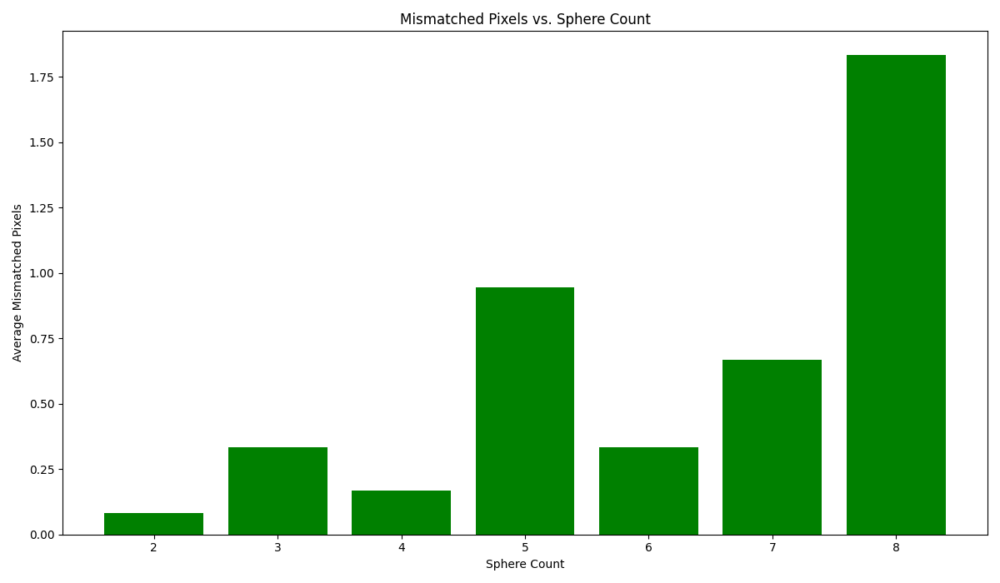

# Cuda Raytracing Implementation

**Note**
This project was completed as part of the final project requirements for [MPCS
52072 GPU Programming](https://mpcs-courses.cs.uchicago.edu/2024-25/summer/courses/mpcs-52072-1).


_Example output of the ray tracing program implemented._

# Table of Contents

- [How to Build and Use this project](#Usage)
- [Report](#Report)
  - [Task 2 - System Write Up](#task-2-system-write-up)
  - [Task 3 - Advanced Feature Write Up](#task-3-advanced-feature)

## How to Build and Use this Project

**To build the project:**

Navigate to the root of the project:

```bash
cd path/to/root/of/project
```

and then from the root of the project run:

```bash
# If using the peanut cluster
sbatch generate_graphs.sh

# If running locally
./generate_graphs.sh
```

to generate the executables. This should result in the follow:

```bash
Root Directory/
├── data/
│   ├── scene_1.txt
│   ├── scene_2.txt
│   └── ... more scene files
├── include/
│   ├── cuda_raytracer.h
│   ├── raytracer.h
│   └── utils.h
├── src/
│   ├── compare_images.cpp
│   ├── cuda_raytracer.cu
│   ├── scene_generator.cpp
│   ├── sequential_raytracer.cpp
│   └── utils.cpp
├── output/
├── Makefile
├── README.md
├── main.cpp
├── main.cu
├── create_graph.py
├── generate_graphs.sh
├── -- EXECUTABLES GENERATED --
├── sequential_raytracer
├── cuda_raytracer
├── scene_generator
└── compare_images
```

### Explanation of each executable

`scene_generator`

Generates a `scene.txt` files that contains the configuration of the scene to be
generated. `scene.txt` has the following structure:

```bash
number of spheres
x y z r
...
x y z r
```

where `x y z` are the coordinates of the sphere in 3D space and `r` is the
radius of the sphere. The files are placed in the `data` directory by default.

`sequential_raytracer`

The executable for the sequential raytracing program. The executable generates a `.ppm` file placed in the `output` directory that contains the dimensions and pixel data for the raytraced image.

`cuda_raytracer`

The executable for the `CUDA` raytracing program. The executable generates a `.ppm` file placed in the `output` directory that contains the dimensions and pixel data for the raytraced image.

`compare_images`

Compares the `.ppm` output files and checks for differences between the image
outputs by comparing pixel values. Of note, a tolerance of `1e-2f` is set.

**Option Toggling with Flags**

The following flags have been implemented to configure execution parameters:

`-d` - specifies the dimensions of the **output** image. (Both CUDA and
Sequential executables)

`-b` - specifies the block size for the CUDA executable (Default is a 16 x 16
block size)

`-u` - toggles the `Unified Memory` advanced feature and will perform the
raytracing using unified memory.

**Example Usage:**

```bash

# Execute the sequential raytracer without any additional features

./sequential_raytracer [scene_file.txt]

# To specify the output image to have dimensions 400 x 400.

./sequential_raytracer -d 400 400 [scene_file.txt]

# Execute the basic CUDA kernel without any additional features

./cuda_raytracer [scene_file.txt]

# Execute the unified memory CUDA kernel

./cuda_raytracer -u [scene_file.txt]

# Launch the CUDA program using with unified memory and a 16 x 16 block size.

./cuda_raytracer -u -b 16 16 [scene_file].txt
```

# Report

## System Specs

The experiment was run on a computer with the following specs:

- Hardware Model: Dell Precision 5570

- Memory: 32GB DDR45 RAM

- GPU: NVIDA RTX A2000 8GB Laptop GPU PCIe/SSE2

- CPU: 12th Gen Intel Core i9-12900H

- OS: [PopOS 22.04 (Ubuntu derivate created by System 76)](https://pop.system76.com/)

## Task 2 System Write-Up

### Program Description:

The program is a ray tracing application that renders 3D scenes by simulating the
how light rays interact with objects in the scene. Simulating light rays with ray tracing is often used in
computer generated 3D scenes, such as videogames, in order to make them look more realistic by computing the intersection of light rays and objects. Ray tracing is a computationally intensive process as it requires the computer to perform accurate floating point calculations for each pixel on the screen. Ray tracing is a problem well suited for being parallelized on the GPU due to the computations for each pixel having no dependency on other the results of other pixels in the image. This lack of dependency means that thread is able to work completely independently without needing to wait for another thread's output.

The main challenge of ray tracing is how to efficiently create how quality
renderings of 3D scenes while also maintaining floating point computational precision of how the light right interacts with objects in the scene for each pixel. The loss of precision is a result of GPUs being optimized for _single-precision arithmetic_ rather than _double precision arithmetic_. In contrast, CPUs are optimized for _double precision arithmetic_. This means that the core of the problem lies in finding a balance between leveraging the speed increase offered by the GPU while maintaining accuracy compared to the slower but more accurate CPU. In this implementation, a tolerance if `1e-2f` was used for the pixel values. This means that if the computed pixel values between the different versions of the ray tracing program are within `1e-2f` then the output is considered the same.

### Experiment Design

The experiment is similar to the image processing assignments. Configurations for inputs include different image dimensions and the number of spheres in the scene.
Image size changes the number of pixels needed to be processed. The number of spheres in the scene affects the number of intersections between light rays and objects in the scenes which affects the number of surface normal and shading computations.

For each implementation (sequential, basic CUDA kernel, unified memory), 10 timed trials are run for each configuration.
Trials are run for every combination of image size and sphere count. The average of the trials based image size and sphere count are plotted into two separate bar graphs.

### Implementation Details:

At a high level, both the sequential and the GPU ray tracing implementations
perform the same operations.

First the camera is initialized with the following
attributes:

- Position - The location of the camera within the scene
- Orientation - The direction of the camera
- Field of view - The observable world as seen by the camera
- Resolution - The dimensions of the image.

Next, the pixels are processed by the ray tracing algorithm. The algorithm will
determine the color of each pixel by tracing rays through the scene. The color
of each pixel is determined by tracing a ray from the camera's position through
the scene in an attempt to simulate a ray of light.

When the algorithm reaches a pixel where the ray of light being traced
intersects with an object in the scene, the normal surface normal is calculated.
The surface normal is a perpendicular vector to the surface at the point of
intersection with the surface of the object. This vector is used to determine
how light reflects off the surface of the object. For the purposes of this
project, simple shading is implemented. The calculation for shading is given by:

```c
    Vec3 hit_point = ray.origin + ray.direction * t_min;
    Vec3 normal = (hit_point - hit_sphere->center).normalize();
    return (normal + Vec3(1, 1, 1)) * 0.5f;
```

The framebuffer (an array of pixels) is then updated with the result of the
surface normal computation. The framebuffer can then be saved as an image file
to be viewed.

#### Sequential Implementation

At its core, the sequential implementation of the ray tracer simply iterates
over every pixel in the image. For each pixel, the ray tracing algorithm calculates the direction of the light ray that
passes through the pixel, and determines how the light ray interacts with the
objects in the scene. The program then computes the color of the pixel based on
the interaction.

**Load Balancing**

The sequential implementation does not implement any type of load balancing as
each pixel is processed independently within the main loop by a single thread.

**Latency**

The sequential implementation has **high latency** due to each pixel being
processed one at a time. The throughput is therefore limited by the CPU's
ability to execute floating point calculations. In other words, the performance
of the program is bound to how quickly the CPU can perform the floating point
calculations as there is no way to hide the latency through parallelism.

### GPU Implementation

The GPU implementation leverages CUDA to parallelize the ray tracing
computations by dividing the image into blocks of threads. Each thread is
responsible for computing the color of a single pixel.

**Load Balancing**

Ostensibly, the work is distributed evenly among the GPU's threads where each thread
operates on a single pixel. However, on a more granular level, the key factor
in load balancing for the GPU implementation is the choice of block and grid
size. It's imperative that the block and grid sizes are picked so that SM
occupancy is maximized, otherwise there might be idle threads within each
block/warp.

**Latency**

The GPU implementation minimizes latency and increases throughput by virtue of being
parallelized. Compared to the sequential implementation that can only process a
single pixel on a single thread, the GPU implementation processes the number of
pixels equivalent to the size of a block multiplied by the number of blocks in
the grid.

#### Hotspots, Bottlenecks, Challenges

**Hotspots**

The main hotspot is parallelizing the ray tracing operation. In the sequential
implementation each pixel had to be ray traced one at a time which severely
hindered performance. By concurrently executing the ray tracing algorithm in the
GPU implementation, the ray tracing algorithm was observed to be, on average, at least 100x faster for each of
the output image dimensions and the number of spheres in the scene. This proved
to be a significant performance increase over the sequential implementation.
This can be observed in the `execution_timings_by_image_size` chart that shows.


**Bottlenecks**

One bottleneck that still exists is determining if a pixel intersects with a
sphere in the `trace` kernel.

```c
__device__ Vec3 trace(const Ray &ray, const Sphere *spheres, int numSpheres) {
  float t_min = FLT_MAX;
  const Sphere *hit_sphere = nullptr;
  for (int i = 0; i < numSpheres; ++i) {
    float t;
    bool hit = spheres[i].intersect(ray, t);
    if (hit && t < t_min) {
      t_min = t;
      hit_sphere = &spheres[i];
    }
  }
  if (hit_sphere) {
    Vec3 hit_point = ray.origin + ray.direction * t_min;
    Vec3 normal = (hit_point - hit_sphere->center).normalize();
    return (normal + Vec3(1, 1, 1)) * 0.5f; // Simple shading
  }
  return Vec3(0.5f, 0.7f, 1.0f); // Background color
}
```

As the number of spheres increases, this kernel has to iterate over each sphere
one at a time and check if there is an intersection. While this might be trivial
for a small number of spheres, as the number of spheres increase the kernel will
take longer to execute. A possible optimization may be to implement the
intersection logic as a second kernel that can be parallelized using `dynamic
paralellism`. This bottleneck exists in both the sequential and both GPU implementations.

This can be observed in the `execution_timings_by_sphere_count` chart. **One thing
to note is that the scenes randomly by the `generate_scene` function in my
run of the experiment is that there was only one scene generated with 3, 4, and 7 spheres and hence the irregular data.** Despite this flaw in the experiment, the general trend of the data indicates that as the number of spheres increases so does execution time across all implementations.


In essence, the number of objects in the scene and being unable to parallelize checking
for intersections between light rays and objects within the scene is the key
bottleneck that prevented the CUDA implementations from being even faster.

**Challenges**

As mentioned above, one of the difficulties of using the GPU to parallelize ray
tracing is floating point computation accuracy. To track accuracy, the average
number of mismatched pixels for each image size and sphere count was recorded.
The output of the sequential program were compared against both of the GPU
implementations and the mismatched pixel counts were averaged.




These two charts illustrate how the difference in how the GPU vs the CPU handles
floating point computations can affect the quality of the rendering. Perhaps
predictably, as the pixel count increased so did the number of mismatched pixels. Further, on some runs of the experiment the floating point computations for large images resulted in gray pixels being produced instead of the correct background color or ray traced shaded pixel. Both of these issues exemplify the point discussed above, that one of the core challenges of ray tracing (and other floating point operations) on the GPU is balancing processing speed vs image quality.

#### Comparison between Unified and Non-Unified Memory

In both of the above charts, it's clear that the unified memory implementation
outperforms the non-unified memory implementation. The most likely explanation
for this discrepancy between the two versions lies in the difference between how the data access patterns and the associated data transfer overhead is handled. This is the most likely explanation because both GPU implementations of the ray tracing program execute the operations, the only difference in the two programs is data transfer between the host and device.

In the non-unified memory implementation the entire `framebuffer` is transferred from the device to the host in one operation, and then the `renderKernel` is launched. The program then waits for all threads on the device to synchronize and then copies the `framebuffer` back to the host. In contrast, the `framebuffer` data transfer in the unified memory version is managed by the CUDA runtime which can move data on demand via on-demand paging which only moves data as its needed by the host/device. Further, as a result of the on-demand paging, the `renderKernel` is able to execute the ray tracing algorithm while data is being transferred to/from the device _simultaneously_. Whereas in the non-unified memory version data transfer and kernel execution happened sequentially, in the unified memory version both kernel execution and data transfer happen concurrently.

### Task 3 Advanced Feature

As discussed above, the advanced feature implemented is the use of `unified
memory`. The unified memory feature is implemented in the `main.cu` module and
can be toggled by using the `-u` flag when calling the `cuda_raytracer`
executable. Of note, the unified memory version of the program uses the same
`renderKernel` kernel to perform ray tracing on the scene. The only difference
between the non-unified and unified memory versions of the kernel is the use if
`cudaMallocManaged` to allocate memory for the `framebuffer`, which removed the
need to call `cudaMemcpy` between the host/device to transfer data after the
kernel execution.
